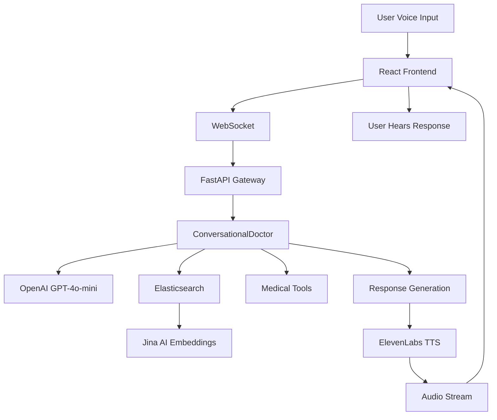
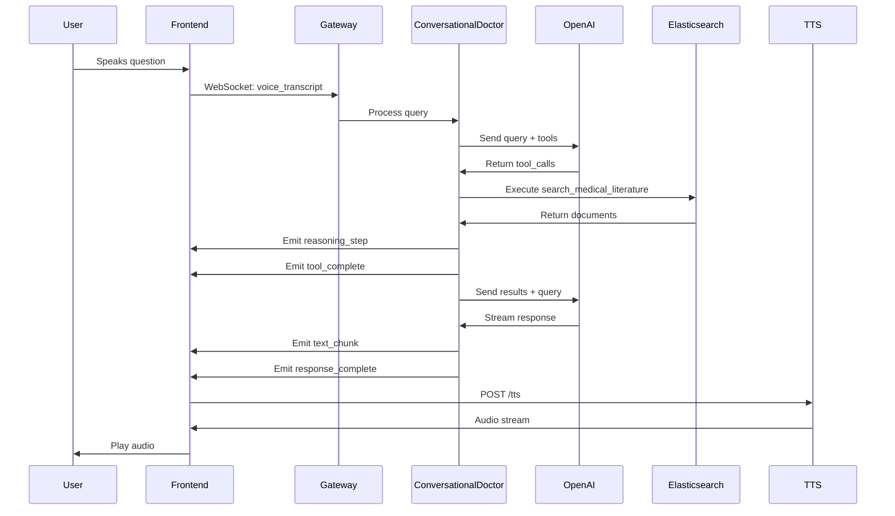

# CareFork - Architecture Diagrams

## System Architecture Overview

```
┌─────────────────────────────────────────────────────────────────┐
│                         USER INTERFACE                           │
│  ┌──────────────────────────────────────────────────────────┐  │
│  │  React Frontend (Vite + TypeScript)                       │  │
│  │  - Voice Interface (Web Speech API)                       │  │
│  │  - Reasoning Display                                      │  │
│  │  - Patient Dashboard                                      │  │
│  │  - Timeline                                               │  │
│  └──────────────────────────────────────────────────────────┘  │
└─────────────────────────────────────────────────────────────────┘
                              │
                              │ WebSocket / HTTP
                              ▼
┌─────────────────────────────────────────────────────────────────┐
│                    GATEWAY LAYER                                 │
│  ┌──────────────────────────────────────────────────────────┐  │
│  │  FastAPI Gateway (Python)                                │  │
│  │  - WebSocket Server (/ws)                                │  │
│  │  - REST API (/patients/{id}/dashboard)                  │  │
│  │  - TTS Proxy (/tts)                                      │  │
│  │  - CORS Middleware                                       │  │
│  └──────────────────────────────────────────────────────────┘  │
└─────────────────────────────────────────────────────────────────┘
                              │
                              │ Routes Requests
                              ▼
┌─────────────────────────────────────────────────────────────────┐
│                    AGENTIC AI LAYER                              │
│  ┌──────────────────────────────────────────────────────────┐  │
│  │  ConversationalDoctor (Python)                          │  │
│  │  - Query Processing                                     │  │
│  │  - Tool Orchestration                                  │  │
│  │  - Conversation History Management                      │  │
│  │  - Streaming Response Generation                        │  │
│  └──────────────────────────────────────────────────────────┘  │
└─────────────────────────────────────────────────────────────────┘
                              │
        ┌─────────────────────┼─────────────────────┐
        │                     │                     │
        ▼                     ▼                     ▼
┌──────────────┐    ┌──────────────┐    ┌──────────────┐
│   OpenAI     │    │ Elasticsearch│    │ Medical Tools│
│   GPT-4o-mini│    │   (Hybrid    │    │   (11 Tools) │
│              │    │    Search)   │    │              │
│ - Reasoning  │    │ - BM25       │    │ - Drug Check │
│ - Tool Calls │    │ - Vector     │    │ - Lab Trends │
│ - Streaming  │    │ - EHR Chunks │    │ - Risk Calc  │
└──────────────┘    └──────────────┘    └──────────────┘
                              │
                              ▼
                    ┌──────────────┐
                    │  Jina AI     │
                    │  Embeddings  │
                    │  (768-dim)   │
                    └──────────────┘
                              │
                              ▼
                    ┌──────────────┐
                    │ ElevenLabs   │
                    │ Text-to-Speech│
                    │ (Audio Stream)│
                    └──────────────┘
```

## Query Processing Flow

```
┌─────────────────────────────────────────────────────────────────┐
│  USER SPEAKS                                                    │
│  "What medications is she taking?"                              │
└─────────────────────────────────────────────────────────────────┘
                              │
                              ▼
┌─────────────────────────────────────────────────────────────────┐
│  FRONTEND: Web Speech API                                       │
│  - Captures audio                                               │
│  - Converts to text                                             │
│  - Sends via WebSocket                                          │
└─────────────────────────────────────────────────────────────────┘
                              │
                              ▼
┌─────────────────────────────────────────────────────────────────┐
│  GATEWAY: WebSocket Handler                                     │
│  - Receives transcript                                          │
│  - Routes to ConversationalDoctor                               │
└─────────────────────────────────────────────────────────────────┘
                              │
                              ▼
┌─────────────────────────────────────────────────────────────────┐
│  CONVERSATIONAL DOCTOR: Process Query                           │
│  ┌──────────────────────────────────────────────────────────┐  │
│  │  1. Add query to conversation history                     │  │
│  │  2. Send to OpenAI with tools                             │  │
│  │  3. Receive tool_calls from OpenAI                        │  │
│  └──────────────────────────────────────────────────────────┘  │
└─────────────────────────────────────────────────────────────────┘
                              │
                              ▼
┌─────────────────────────────────────────────────────────────────┐
│  TOOL EXECUTION LOOP                                            │
│  ┌──────────────────────────────────────────────────────────┐  │
│  │  For each tool_call:                                      │  │
│  │    ├─→ Emit "tool_start" event                           │  │
│  │    ├─→ Execute tool (e.g., search_medical_literature)    │  │
│  │    │     ├─→ Query Elasticsearch                         │  │
│  │    │     └─→ Return documents                            │  │
│  │    ├─→ Emit "tool_complete" event                         │  │
│  │    ├─→ Emit "reasoning_step" events                      │  │
│  │    └─→ Add tool result to conversation history           │  │
│  └──────────────────────────────────────────────────────────┘  │
└─────────────────────────────────────────────────────────────────┘
                              │
                              ▼
┌─────────────────────────────────────────────────────────────────┐
│  FINAL RESPONSE GENERATION                                       │
│  ┌──────────────────────────────────────────────────────────┐  │
│  │  1. Send conversation + tool results to OpenAI           │  │
│  │  2. Stream response chunks                               │  │
│  │  3. Emit "text_chunk" events                             │  │
│  │  4. Emit "response_complete" with full_text              │  │
│  └──────────────────────────────────────────────────────────┘  │
└─────────────────────────────────────────────────────────────────┘
                              │
                              ▼
┌─────────────────────────────────────────────────────────────────┐
│  FRONTEND: Response Handling                                    │
│  ┌──────────────────────────────────────────────────────────┐  │
│  │  1. Display reasoning steps                              │  │
│  │  2. Show final response                                  │  │
│  │  3. Call /tts endpoint                                   │  │
│  │  4. Play audio stream                                    │  │
│  │  5. Return to idle state                                 │  │
│  └──────────────────────────────────────────────────────────┘  │
└─────────────────────────────────────────────────────────────────┘
```

## Data Ingestion Flow

```
┌─────────────────────────────────────────────────────────────────┐
│  FHIR DATA SOURCE                                               │
│  - synthetic_patient.json (dev)                                │
│  - Real FHIR server (production)                                │
└─────────────────────────────────────────────────────────────────┘
                              │
                              ▼
┌─────────────────────────────────────────────────────────────────┐
│  FHIR CLIENT                                                    │
│  - Fetches Patient, Conditions, Medications, etc.               │
│  - Aggregates all resources                                     │
└─────────────────────────────────────────────────────────────────┘
                              │
                              ▼
┌─────────────────────────────────────────────────────────────────┐
│  NORMALIZATION                                                  │
│  - Converts FHIR resources to chunks                            │
│  - Extracts text and metadata                                   │
│  - Creates searchable format                                    │
└─────────────────────────────────────────────────────────────────┘
                              │
                              ▼
┌─────────────────────────────────────────────────────────────────┐
│  EMBEDDING GENERATION                                           │
│  - Sends text to Jina AI API                                    │
│  - Receives 768-dimensional vectors                             │
│  - Attaches to chunks                                           │
└─────────────────────────────────────────────────────────────────┘
                              │
                              ▼
┌─────────────────────────────────────────────────────────────────┐
│  ELASTICSEARCH INDEXING                                         │
│  - Index: ehr_chunks                                            │
│  - Fields: text, embedding, metadata, timestamp                 │
│  - Ready for hybrid search                                      │
└─────────────────────────────────────────────────────────────────┘
```

## Search Flow (Hybrid Search)

```
┌─────────────────────────────────────────────────────────────────┐
│  USER QUERY                                                     │
│  "What medications is she taking?"                              │
└─────────────────────────────────────────────────────────────────┘
                              │
                              ▼
┌─────────────────────────────────────────────────────────────────┐
│  QUERY EMBEDDING                                                │
│  - Send query text to Jina AI                                   │
│  - Get 768-dimensional vector                                   │
└─────────────────────────────────────────────────────────────────┘
                              │
                              ▼
┌─────────────────────────────────────────────────────────────────┐
│  ELASTICSEARCH HYBRID SEARCH                                    │
│  ┌──────────────────────────────────────────────────────────┐  │
│  │  BM25 (Keyword Search)                                    │  │
│  │  - Matches: "medications", "taking"                      │  │
│  │  - Score: 0.8                                            │  │
│  └──────────────────────────────────────────────────────────┘  │
│  ┌──────────────────────────────────────────────────────────┐  │
│  │  Vector Search (Semantic)                                 │  │
│  │  - Cosine similarity with query embedding                │  │
│  │  - Score: 0.7                                            │  │
│  └──────────────────────────────────────────────────────────┘  │
│  ┌──────────────────────────────────────────────────────────┐  │
│  │  Combined Score = (BM25 × 0.4) + (Vector × 0.6)          │  │
│  │  - Returns top N relevant chunks                          │  │
│  └──────────────────────────────────────────────────────────┘  │
└─────────────────────────────────────────────────────────────────┘
                              │
                              ▼
┌─────────────────────────────────────────────────────────────────┐
│  RESULTS                                                        │
│  - MedicationRequest chunks                                     │
│  - Patient medication history                                   │
│  - With citations and metadata                                  │
└─────────────────────────────────────────────────────────────────┘
```

## Real-time Communication Flow

```
┌──────────────┐                                    ┌──────────────┐
│   FRONTEND   │                                    │    BACKEND   │
│   (Browser)  │                                    │   (FastAPI)  │
└──────┬───────┘                                    └──────┬───────┘
       │                                                    │
       │  WebSocket Connection                              │
       │───────────────────────────────────────────────────>│
       │                                                    │
       │  voice_transcript: "What medications..."          │
       │───────────────────────────────────────────────────>│
       │                                                    │
       │                    reasoning_step: "Checking records"│
       │<───────────────────────────────────────────────────│
       │                                                    │
       │                    tool_start: "search_medical..." │
       │<───────────────────────────────────────────────────│
       │                                                    │
       │                    tool_complete: {...results...}  │
       │<───────────────────────────────────────────────────│
       │                                                    │
       │                    reasoning_step: "Found 5 docs"  │
       │<───────────────────────────────────────────────────│
       │                                                    │
       │                    text_chunk: "She's taking..."   │
       │<───────────────────────────────────────────────────│
       │                    text_chunk: "...medication X"   │
       │<───────────────────────────────────────────────────│
       │                                                    │
       │                    response_complete: {full_text} │
       │<───────────────────────────────────────────────────│
       │                                                    │
       │  HTTP POST /tts                                     │
       │───────────────────────────────────────────────────>│
       │                                                    │
       │                    audio/mpeg stream               │
       │<───────────────────────────────────────────────────│
       │                                                    │
       │  Play audio                                         │
       │                                                    │
```

## Component Interaction Diagram

```
┌─────────────────────────────────────────────────────────────────┐
│                        FRONTEND COMPONENTS                      │
│                                                                 │
│  ┌──────────────┐  ┌──────────────┐  ┌──────────────┐        │
│  │  LeftPanel   │  │ CenterPanel  │  │ RightPanel   │        │
│  │              │  │              │  │              │        │
│  │ - Patient    │  │ - Voice      │  │ - Timeline   │        │
│  │   Info       │  │   Interface  │  │ - Commits    │        │
│  │ - Vitals     │  │ - Reasoning  │  │ - Events    │        │
│  │ - Treatment  │  │   Display    │  │             │        │
│  │ - Recovery   │  │ - Response   │  │             │        │
│  └──────────────┘  └──────────────┘  └──────────────┘        │
│                                                                 │
│  ┌──────────────┐  ┌──────────────┐                          │
│  │ Overlays     │  │ App.tsx       │                          │
│  │              │  │              │                          │
│  │ - Citations  │  │ - State Mgmt │                          │
│  │ - Decision   │  │ - WebSocket  │                          │
│  │   Tree       │  │ - Voice API  │                          │
│  └──────────────┘  └──────────────┘                          │
└─────────────────────────────────────────────────────────────────┘
                              │
                              │ State & Events
                              ▼
┌─────────────────────────────────────────────────────────────────┐
│                        BACKEND COMPONENTS                      │
│                                                                 │
│  ┌──────────────┐  ┌──────────────┐  ┌──────────────┐        │
│  │ Gateway      │  │ Conversational│  │ Tools        │        │
│  │              │  │ Doctor       │  │              │        │
│  │ - WebSocket  │  │              │  │ - Search     │        │
│  │ - REST API   │  │ - Orchestrates│  │ - Analysis  │        │
│  │ - TTS Proxy  │  │ - Manages     │  │ - Prediction│        │
│  │              │  │   History    │  │ - Calculation│       │
│  └──────────────┘  └──────────────┘  └──────────────┘        │
│                                                                 │
│  ┌──────────────┐  ┌──────────────┐                          │
│  │ Elastic      │  │ FHIR Client  │                          │
│  │ Client       │  │              │                          │
│  │              │  │ - Fetches    │                          │
│  │ - Search     │  │   Resources  │                          │
│  │ - Index      │  │ - Aggregates │                          │
│  └──────────────┘  └──────────────┘                          │
└─────────────────────────────────────────────────────────────────┘
```

## State Machine: Voice Interface

```
                    ┌─────────┐
                    │  IDLE   │
                    └────┬────┘
                         │
                         │ User clicks record
                         ▼
                    ┌─────────────┐
                    │ LISTENING  │
                    └─────┬──────┘
                          │
                          │ Speech recognized
                          ▼
                    ┌─────────────┐
                    │  THINKING  │
                    └─────┬──────┘
                          │
                          │ Tools executing
                          ▼
                    ┌─────────────┐
                    │ REASONING  │
                    └─────┬──────┘
                          │
                          │ Response ready
                          ▼
                    ┌─────────────┐
                    │  SPEAKING  │
                    └─────┬──────┘
                          │
                          │ Audio finished
                          └──────┐
                                  │
                                  ▼
                            ┌─────────┐
                            │  IDLE   │
                            └─────────┘
```

## Mermaid Diagrams (for GitHub/Markdown viewers)

### System Architecture



### Query Processing



### Data Flow


---

*These diagrams can be viewed in any Markdown viewer that supports ASCII art or Mermaid diagrams.*
